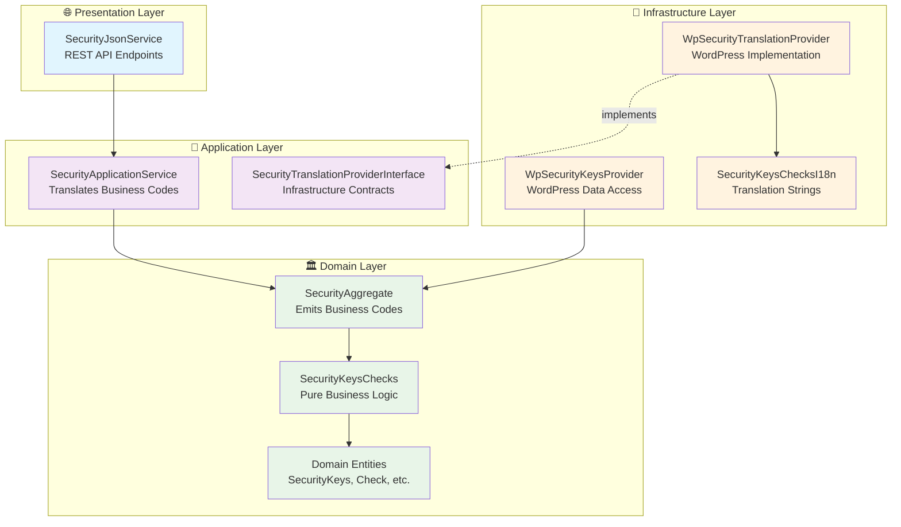
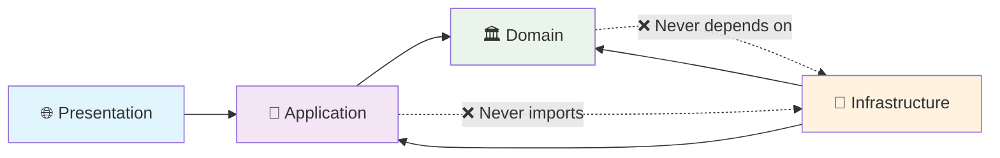

# Roko - WordPress Health & Performance Plugin

<!-- BADGES-START -->
[](https://github.com/JosephGabito/roko/actions/workflows/code-quality.yml)
[](https://github.com/JosephGabito/roko/commits/main)
[](https://github.com/JosephGabito/roko/issues)
[](LICENSE)
<!-- BADGES-END -->

**The loud-mouthed mechanic your WordPress site desperately needs.**

Roko is a comprehensive WordPress optimization and health monitoring plugin that diagnoses performance bottlenecks, security vulnerabilities, plugin conflicts, and maintenance issues. Built with Domain-Driven Design (DDD) architectural patterns to demonstrate clean code practices in WordPress development.

## 🏗️ Architecture Overview

Roko demonstrates **clean architecture principles** with strict separation of concerns across four distinct layers. This example shows the Security domain - similar patterns are applied across Performance, Monitoring, and other domains:



## 🎯 DDD Principles in Action

### **Layer Responsibilities**

| Layer | May Import/Depend On | Never Imports | Example Classes |
|-------|---------------------|---------------|-----------------|
| **🌐 Presentation** | Application DTOs/Commands | Domain or Infrastructure directly | `SecurityJsonService` |
| **🎯 Application** | Domain abstractions, owns interfaces | Infrastructure concretes | `SecurityApplicationService` |
| **🏛️ Domain** | **Nothing** (pure) | Infrastructure, frameworks, UI | `SecurityAggregate`, `SecurityKeysChecks` |
| **🔌 Infrastructure** | Domain types, Application interfaces | **Nothing above it** | `WpSecurityTranslationProvider` |

### **Dependency Flow (Clean Architecture)**



## 📁 Project Structure

This shows the Security domain as an example - similar patterns are used for Performance, Monitoring, and other domains:

```
src/
├── 🏛️ Domain/
│   ├── Security/                          # Security Domain (shown as example)
│   │   ├── SecurityAggregate.php          # Aggregate Root
│   │   ├── Checks/
│   │   │   ├── SecurityKeysChecks.php     # Domain Service
│   │   │   └── ValueObject/
│   │   │       ├── Check.php              # Value Object
│   │   │       ├── CheckStatus.php        # Enum-like Value Object
│   │   │       └── Severity.php           # Enum-like Value Object
│   │   └── SecurityKeys/
│   │       ├── Entity/
│   │       │   └── SecurityKeys.php       # Domain Entity
│   │       └── ValueObject/
│   │           └── SecurityKey.php        # Value Object
│   ├── Performance/                       # Performance Domain (similar structure)
│   ├── Monitoring/                        # Monitoring Domain (similar structure)
│   └── ...                                # Other domains follow same patterns
├── 🎯 Application/
│   └── Security/                          # Application layer for Security domain
│       ├── SecurityApplicationService.php # Use Case Orchestrator
│       └── Provider/
│           └── SecurityTranslationProviderInterface.php # Contract
└── 🔌 Infrastructure/
    └── WordPress/                         # WordPress details, hooks, $wpdb, get_post, i18, etc
        ├── Plugin.php                     # DI Container & Bootstrap
        └── Security/                      # Infrastructure for Security domain
            ├── SecurityJsonService.php    # REST Controller
            ├── WpSecurityKeysProvider.php # Data Access
            ├── Provider/
            │   └── WpSecurityTranslationProvider.php
            └── I18n/
                └── SecurityKeysChecksI18n.php
```

## 🔍 Architecture Patterns

### **1. Domain Emits Business Codes**

Domain entities emit business codes - Application layer handles translation:

```php
// ✅ Domain emits business codes, never handles i18n
class SecurityKeysChecks {
    public static function fromSecurityKeys(SecurityKeys $securityKeys): self {
        // Pure business logic
        $recommendationCode = $strength . '_' . $source; // Business code: "weak_constant"
        
        return new Check(
            $id, $label, $status, $severity, $description, $evidence,
            $recommendationCode, // Domain emits codes like "SEC_KEY_WEAK"
            'roko'
        );
    }
}

// ✅ Application translates business codes to human text
class SecurityApplicationService {
    public function getSecuritySnapshot() {
        $domainSnapshot = $this->securityAggregate->snapshot(); // Gets business codes
        return $this->translateBusinessCodes($domainSnapshot);  // Converts to human text
    }
}
```

### **2. Single-Purpose Application Services**

Each application service focuses on one specific use case:

```php
// ✅ Focused, single-responsibility service
class SecurityApplicationService {
    public function getSecuritySnapshot() {
        // Get translations from infrastructure
        $recommendations = $this->translationProvider->getAllSecurityKeyRecommendations();
        
        // Let domain handle its own serialization
        return $this->securityAggregate->snapshot($recommendations);
    }
}
```

### **3. Interface Segregation**

Clean contracts between layers:

```php
// ✅ Application defines what it needs
interface SecurityTranslationProviderInterface {
    public function getAllSecurityKeyRecommendations();
}

// ✅ Infrastructure provides WordPress-specific implementation
class WpSecurityTranslationProvider implements SecurityTranslationProviderInterface {
    public function getAllSecurityKeyRecommendations() {
        // WordPress-specific translation logic
    }
}
```

### **4. Dependency Inversion Principle**

Infrastructure implements interfaces defined by Application layer:

```php
// ✅ Application defines the contract
interface SecurityTranslationProviderInterface {
    public function getAllSecurityKeyRecommendations();
}

// ✅ Infrastructure implements the contract
class WpSecurityTranslationProvider implements SecurityTranslationProviderInterface {
    public function getAllSecurityKeyRecommendations() {
        // WordPress-specific implementation.
        // Hooks lives here as well.
    }
}

// ✅ Application depends on abstraction, not concrete
class SecurityApplicationService {
    public function __construct(
        SecurityAggregate $securityAggregate,
        SecurityTranslationProviderInterface $provider  // ← Interface, not concrete
    ) {
        // Infrastructure implementation injected at runtime
    }
}
```

### **5. Dependency Injection at the Root**

All dependencies wired at the application entry point:

```php
// ✅ Clean dependency injection
class Plugin {
    public function init() {
        // Domain layer - pure business logic
        $securityAggregate = new SecurityAggregate(/*...*/);
        
        // Infrastructure providers (implement Application interfaces)
        $translationProvider = new WpSecurityTranslationProvider();
        
        // Application layer - receives Infrastructure via interfaces
        $securityApplicationService = new SecurityApplicationService(
            $securityAggregate,
            $translationProvider  // ← Concrete injected, but Application sees interface
        );
        
        // Presentation layer - REST API endpoints
        new SecurityJsonService($securityApplicationService);
    }
}
```

## 🔧 What Roko Does

Roko is your WordPress site's diagnostic tool, covering multiple areas:

### **🚀 Performance Optimization**
- **Plugin Performance Heatmap**: Identifies slow plugins dragging down load times
- **Database Optimization**: Cleans up bloated tables and unused data
- **Core Web Vitals Tracking**: Monitors TTFB, LCP, CLS metrics
- **Query Analysis**: Spots inefficient database queries

### **🛡️ Security Health**
- **Security Keys Analysis**: Evaluates WordPress security keys and salts
- **File Integrity Monitoring**: Detects unauthorized file modifications
- **Vulnerability Scanning**: Checks for known security issues
- **File Permission Auditing**: Validates proper file and directory permissions

### **🔍 Diagnostics & Monitoring**
- **Plugin Conflict Detection**: Isolates problematic plugin combinations
- **Multi-site Dashboard**: Manages multiple WordPress installations
- **Health Check Scoring**: Provides overall site health ratings
- **Smart Action Recommendations**: Suggests specific fixes for issues

### **⚡ Quick Fixes**
- **One-Click Optimizations**: Database cleanup, cache purging, plugin updates
- **Auto-fix Security Issues**: Resolves common security misconfigurations  
- **Performance Tuning**: Applies proven optimization techniques
- **Accessibility Improvements**: Suggests alt-text and other accessibility fixes

## Development Setup

1. Clone and install dependencies:
```bash
git clone https://github.com/JosephGabito/roko.git
cd roko
composer install
```

## Development Workflow

### Composer Scripts

| Command | Description |
|---------|-------------|
| `composer test` | Run all tests (syntax, compatibility, coding standards, unit tests) |
| `composer phpunit` | Run unit tests only |
| `composer test-unit` | Run unit test suite |
| `composer phpcs` | Check WordPress Coding Standards |
| `composer phpcbf` | Auto-fix coding standards issues |
| `composer php74-compat` | Check PHP 7.4 compatibility |
| `composer php70-compat` | Check PHP 7.0 compatibility |
| `composer syntax-check` | Validate PHP syntax |

### Quick Commands

```bash
# Run all quality checks including unit tests
composer test

# Run just unit tests
composer phpunit

# Fix coding standards
composer phpcbf

# Check PHP 7.4 compatibility
composer php74-compat
```

## Code Standards

- **Architecture**: Domain-Driven Design (DDD) with clean architecture
- **Code Standards**: WordPress Coding Standards (WPCS)
- **Compatibility**: PHP 7.0+ compatibility
- **Autoloading**: PSR-4 autoloading
- **Naming**: Snake_case for methods and classes (WordPress convention)
- **Testing**: Unit tested with PHPUnit
- **Type Safety**: Strict typing where PHP version allows

## 🚀 Why This Architecture?

### **Understanding Dependency Direction**

```
Presentation  →  Application  →  Domain
                  ↑              ↑
Infrastructure  ──┘──────────────┘
```

**Key insight**: Infrastructure **serves** higher layers by implementing their contracts:
- **Application defines interfaces** → Infrastructure implements them
- **Domain stays pure** → Never depends on external concerns  
- **Domain emits business codes** → Application translates to human text
- **Testability** → Easy to mock Infrastructure implementations
- **Flexibility** → Swap WordPress for Laravel/Symfony without changing Domain

**Architecture principle**: The Domain layer avoids outward dependencies by emitting business codes like `weak_constant`, `strong_roko` rather than translated text. This separation allows the Application layer to handle translation concerns independently from business logic.

### **Benefits**

- ✅ **Maintainable**: Clear separation of concerns
- ✅ **Testable**: Easy to unit test business logic
- ✅ **Flexible**: Easy to swap implementations
- ✅ **Scalable**: Can handle complex business requirements
- ✅ **Framework-Independent**: Domain logic works anywhere

### **Enterprise Patterns**

- **Repository Pattern**: Clean data access abstraction
- **Aggregate Root**: Consistent domain boundaries
- **Value Objects**: Immutable, self-validating data
- **Domain Services**: Complex business logic coordination
- **Application Services**: Use case orchestration
- **Dependency Inversion**: High-level modules don't depend on low-level modules

## Release

```bash
./bin/release.sh 1.0.0
```

---
